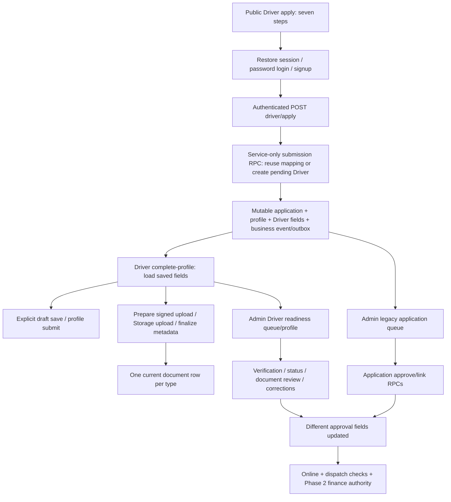

# MOOVU Phase 6 Driver Onboarding & Car Scanner Audit

Audit date: 16 September 2026. Repository: `D:\Users\KN Mudau\Desktop\Websites\moovu-kasi-rides-redesign`. Production project: `mvazbszenqahgqpznhhq`. Existing disposable target for a later approved gate: `tangtlmdpnvmoviwrgvd`.

## 1. Audit Verdict

**BLOCKED — SECURITY, PRIVACY, DATA OR ARCHITECTURE ISSUE**

The audit is complete within the permitted read-only scope; Phase 6 implementation and release readiness are blocked. Production metadata establishes that linked Drivers can update approval and document-review columns on their own rows without field-level restrictions. Existing submitted profiles and evidence are mutable, approval entry points do not enforce one consistent validation contract, and there is no versioned inspection or submission model. Sections 8, 10 and 45 identify the concrete blockers and smallest remediation.

Confidence is high for inspected local source, production schema, privileges, policies and aggregate findings. Confidence is limited for exact deployed server-source parity, signed-in business behavior, provider configuration, mobile device behavior and legal compliance. No artificial application, document, trip, payment, login or notification was created. No exploit was attempted. Passing this audit or its local checks grants no implementation or production authority.

## 2. Evidence Map

Local references below are relative to the absolute repository root above. Line references identify current local source, not a proven deployed revision. Production observations were made between approximately 10:35 and 10:42 UTC on 16 September 2026. They are separate query snapshots, not one transactionally frozen snapshot.

| CLAIM | LOCAL SOURCE | DEPLOYED | PRODUCTION DB | STORAGE | STATUS | CONFIDENCE |
|---|---|---|---|---|---|---|
| Public guided application exists | `src/app/driver/apply/page.tsx:27`, `:189` | GET `/driver/apply` 200; readiness text present | 55 application rows | Not applicable | PARTIAL | High for UI/source; server parity unverified |
| Submission authenticates ownership | `src/app/api/driver/apply/route.ts:18`; `src/lib/drivers/applicationIdentity.ts:4` | Exact server body unverified | Installed service-only submission RPC | Not applicable | LIVE/AUTHORITATIVE DB; local server contract | High for DB/local |
| Draft profile can resume | `src/app/driver/complete-profile/page.tsx:142`, `:279`; profile GET/save APIs | Anonymous profile GET 401 | 56 mutable profiles | Independent uploads | PARTIAL | High |
| Approval fields are writable by linked Driver | Existing onboarding SQL; policies queried directly | Data API exposure setting not independently read | UPDATE grants, ownership-only policies, no protective trigger | Not applicable | LIVE permission weakness | High; not exploited |
| Private uploads exist | `src/lib/driver-documents.ts:392`, `:436`; upload API | Exact upload runtime unverified; no upload performed | 227 document records | `driver-docs` private, 344 objects | PARTIAL | High for stored configuration |
| Review/corrections exist | Admin verification/review/corrections APIs | Anonymous Admin GETs 401 | 34 corrections; review-notes table absent | Signed read helper | PARTIAL | High |
| Structured scanner exists | No implementation found in scoped source | Not established | No scanner/inspection/Phase 6 table names found | No dedicated scanner bucket found | PROPOSED | High for inspected scope |
| Google/Apple login is active | No `signInWithOAuth`/`linkIdentity` flow found | Not tested | Existing identities: email only | Not applicable | UNKNOWN provider enablement; PROPOSED app flow | High for identity aggregate only |
| Phase 2 authoritative policy | `src/lib/finance/phase2DriverEligibility.ts:34`; cutover report | Current READY deployment matches documented deployment ID | AUTHORITATIVE, 1500/1500 bps, 5000 cents, subscription false | Not applicable | LIVE/AUTHORITATIVE policy | High DB; application mode not directly queried |
| Phase 4/5 effective policy | Completion reports, finance APIs | Current source parity unverified | Phase 4 effective; Phase 5 active/effective | Not applicable | LIVE policy | High DB |

Evidence classes used: LOCAL SOURCE, LOCAL CONFIGURATION, DEPLOYED SOURCE (only directly observable route output), PRODUCTION DATABASE, STORAGE CONFIGURATION, DOCUMENTATION, REPORTED/UNVERIFIED and PROPOSED. “Not found” is scoped inspection evidence, not proof that no external operational process exists.

## 3. Repository and Deployment State

Workspace and project `AGENTS.md` and applicable workflow, MOOVU project, Supabase, mobile, notification, repository inspection, testing and final-response skills were read. README is the generic Next.js bootstrap document. `docs/APP_INDEX.md`, `docs/CHANGE_PROTOCOL.md` and a repository `supabase/` directory were absent. Database definitions are largely SQL documents under `docs/`; their presence does not establish installation.

Baseline commands: `git status --short`, `git branch --show-current`, `git rev-parse HEAD`, `git remote -v`, `git diff --check`. Branch `main`; HEAD `87dfec653d2b0791ff5dcb8295ae9dfa4a96ded4`; origin `https://github.com/modaukgala/moovu-app.git`. Baseline worktree contains 232 modified/untracked entries, including onboarding, financial, dispatch, UI, reports and scripts. All were preserved. This report did not exist before the audit.

Read-only `npx --yes vercel inspect moovurides.co.za` returned production deployment `dpl_DXSpah8kBx3VSjep1o9mMneq1ZC1`, READY, created 15 September 2026 at 18:53:16 UTC, URL `https://moovu-pk7slrv9b-kgalaletsos-projects.vercel.app`, aliased to Customer/Admin/Driver production domains. The Vercel connector returned a scope-authorization error; the existing authenticated CLI successfully read public deployment metadata. No credential or encrypted environment retrieval was attempted. Deployed Git revision and exact dirty-tree/server-source parity remain UNVERIFIED: a matching report deployment ID is documentation evidence, not byte-for-byte parity.

Local configuration: Node 24.13.0; Next 16.1.6; React 19.2.3; TypeScript range ^5; Supabase JS ^2.98.0/SSR ^0.9.0; Capacitor platforms/core ^8.3.3, Camera ^8.2.0. Package lock exists; these declared ranges do not replace installed-version verification before implementation. Scripts include `npm test`, `npm run lint`, `npm run build`, target builds and sequential target-specific iOS scripts.

Mobile: shared `android/`; separate `ios-driver/` and `ios-customer/`; `capacitor.driver.config.ts` uses `za.co.moovu.driver`, Driver domain and Driver shell; Customer config uses `za.co.moovu.customer`. `capacitor.config.ts` rejects an unspecified target. Split Android workspace is referenced by workspace instructions but its packaged artifacts/device state were not verified. No sync/build/archive was run.

## 4. Verified Roadmap State

| Phase | Observation | Claim classification |
|---|---|---|
| 0 | Final-production report says complete; 20 `phase05*` production RPCs exist; inspected applicant RPCs are service-only; protected GET routes reject anonymous requests | Foundation presence VERIFIED; blanket completion REPORTED/UNVERIFIED given onboarding weaknesses |
| 1 | `financial_accounts`, `financial_transactions`, `financial_ledger_entries` exist with RLS; 3/4/8 rows; zero imbalanced posted transactions | Ledger foundation VERIFIED; entire historic validation claim DOCUMENTATION |
| 2 | Policy AUTHORITATIVE; Go/XL 15%; R50; subscription false; authoritative cutoff `2026-09-15T19:04:38Z` | Policy VERIFIED; exact current app variable and natural-event closure not directly proven here |
| 3 | User reports postponed/runtime removal; local booking/payment-method regression tests pass | Local removal controls VERIFIED; complete deployed removal REPORTED/UNVERIFIED in this bounded audit |
| 4 | `phase4-2026-09-owner-v1`, effective since `2026-09-14T18:00:00Z`; completion report notes natural-event reconciliation pending | Active DB policy VERIFIED; full operational completion not re-proven |
| 5 | `phase5-2026-09-owner-v1`, active since `2026-09-15T09:22:00Z` | Active DB policy VERIFIED; full operational completion not re-proven |
| 6 | Existing legacy onboarding only; no structured scanner/version tables found | Not implemented VERIFIED for inspected source/schema |

Phase 2's authoritative boundary is the separate `authoritative_effective_from`; the SHADOW `effective_from` remains 11 September. Older Phase 5 documentation saying SHADOW/subscription required is an historical snapshot superseded by the current Phase 2 policy, not a reason to reactivate subscriptions. No earlier phase was reopened or changed.

## 5. Current Authentication

Driver login: `src/app/driver/login/page.tsx:19` calls Supabase email/password login and routes to `/driver`. Apply uses `getApplicantSession` to restore the same-email session, try password login, then sign up only after invalid credentials. Confirmation-required signup produces no submission without a session. Inputs survive only while that page remains open. Signup places requested role/name/phone in user metadata; that metadata is not trustworthy authorization.

Customer: `src/app/customer/auth/page.tsx:142` uses password auth, with email/phone lookup behavior; `/api/customer/register` validates basic fields/legal acceptance and creates a confirmed Auth user with service access, then upserts Customer identity. Phone is an identifier/lookup, not proof of possession or a verified phone-OTP login. Customer recovery route and `customer/auth/reset/page.tsx:26` support password recovery/code exchange. No Driver magic-link/phone-OTP/social flow was found. Driver-specific password recovery needs a coherent future flow.

Server: Driver APIs validate Bearer tokens using `auth.getUser`, then resolve `driver_accounts.user_id` to `driver_id`. Admin `requireAdminUser` reads `profiles.role` from the DB and permits owner/admin/dispatcher/support; user metadata is not the Admin API authority. `profiles.role` defaults to admin in production, but no Auth-user creation trigger was found and no client INSERT/UPDATE policy exists on profiles; the default alone does not prove public Admin escalation.

`middleware.ts:17` performs host/path rewrites, explicitly passes API routes through, and is not an auth guard. Driver has no shared `src/app/driver/layout.tsx` guard; pages/API ownership checks carry the protection. Customer display routing in account/home/history reads user metadata before app metadata. `src/lib/customer/server.ts:130` can repair a missing Customer profile from user metadata; it does not require an explicit Customer role. Apply likewise accepts any valid email-bearing Auth user rather than an explicit Driver enrollment capability. Cross-role intent is therefore inconsistent.

One Auth identity can technically have both a Customer row and Driver mapping; there is no verified explicit multi-role product contract. Recommended: deliberate, server-owned Driver enrollment capability on a reusable Auth identity; no Admin grant from onboarding; explicit portal role selection. A Customer without that capability must fail onboarding even if signed in. Do not duplicate Auth identity merely to change portals.

Deletion: `/api/driver/account/delete` verifies token/mapping then requires password and confirmation, checks active trips and invokes cleanup/anonymization/Auth deletion. It was not executed. Source cleanup tolerates noncritical errors and conflicts with current not-null/schema fields; section 12 details risk. No complete disabled/deleted-account gate was found in all onboarding routes: upload helper verifies existence, not operational status.

The customer-registration existing-user password-update branch at `src/app/api/customer/register/route.ts:107` is dangerous to copy into OAuth linking, but the preceding same-email duplicate check currently rejects that same match. It is not classified as a proven reachable takeover here. Remove/replace that legacy recovery concept in separately approved auth work; never reset another identity's password based on registration input.

## 6. Google and Apple Readiness

No provider buttons/callback implementation, `signInWithOAuth` or `linkIdentity` calls were found in scoped application source. Existing production `auth.identities` aggregate contains 1,272 email identities and no Google/Apple identity rows. This does not prove providers are disabled. Dashboard provider enablement, callback allowlists, client IDs, signing-key rotation and native entitlements are UNVERIFIED; no Auth settings/secrets were retrieved.

`NotificationDeepLinkRouter.tsx:230` handles notification app URLs, not an OAuth exchange contract. Android manifest has launcher/FCM intent filters, not an inspected OAuth callback intent filter; Driver Info.plist has no inspected OAuth URL scheme. Recovery code exchange is not a reusable complete social-login callback. No app-level OAuth state/nonce/PKCE or hijack-resistant callback was established.

PROPOSED minimum: use provider-supported Supabase flow and explicit allowlisted web/native callbacks; validate state/PKCE and native ID-token nonce as applicable to the selected flow; assign Driver enrollment server-side after authenticated consent; resolve the existing Auth UUID and Driver mapping; require authenticated linking/re-authentication for collisions. Apple relay email is a contact address, not a Driver identity key; capture required name on first authorization and allow verified contact correction. Never merge Drivers/finance by client email/phone/SA ID alone.

Supabase documents automatic same-email identity linking and authenticated manual linking. Rely on its verified identity safeguards, not a custom email merge. [Supabase identity linking](https://supabase.com/docs/guides/auth/auth-identity-linking), [Google](https://supabase.com/docs/guides/auth/social-login/auth-google), [Apple](https://supabase.com/docs/guides/auth/social-login/auth-apple).

Offering Google as primary-account login on iOS makes Apple's equivalent privacy-preserving login requirement relevant unless an exception applies; Sign in with Apple is the recommended equivalent option, subject to store review. Existing company-only password login has a documented exception. [Apple guideline 4.8](https://developer.apple.com/app-store/review/guidelines/#login-services). OAuth remains a separately approved configuration gate.

## 7. Current Driver Application Flow

Current seven apply stages are Eligibility, Account, Personal, Documents, Vehicle, Photos and Review. Documents/photo cards are UI-only in public apply; no file enters its POST payload. Portal has actual file inputs and later uploads. Portal draft save is explicit, not debounced autosave; persisted fields resume, step position/local unsaved edits do not have a server draft version.

Two Admin concepts coexist: `/api/admin/applications` lists `driver_applications`; `/api/admin/driver-applications` derives a queue from Driver/profile/documents. Legacy approve/link RPCs and newer verification/status routes affect different statuses. This duplication explains why pending application rows coexist with approved Drivers; it must not be “repaired” automatically during audit.

## 8. Public Apply and Ownership Security

| Finding | Severity | Non-destructive evidence | Required remediation before later activation |
|---|---|---|---|
| S1: Driver may self-update approval/control fields | P0 | Production authenticated UPDATE grant on `drivers`; `has_column_privilege` true for verification; ownership-only `drivers_update_own_linked`/location policies; only timestamp trigger | Revoke broad direct UPDATE; allow narrowly controlled location/profile operations; protect approval/eligibility fields in every route/RPC |
| S2: Driver may self-review or redirect own document reference | P0 | Document INSERT/UPDATE policies restrict Driver ownership only; review column UPDATE privilege true; sync trigger defaults values without forcing pending or checking file ownership | Mediate document metadata/review writes; server-only review fields and stored-object ownership; freeze evidence |
| S3: Signed-in Customer can submit Driver application without deliberate role enrollment | P1 | Apply checks token/email/body identity, not Driver capability; applicant RPC checks Auth existence | Explicit server-owned enrollment/capability contract; do not trust user metadata |
| S4: Submitted/approved profile can be changed without re-review | P1 | Profile-save retains approved verification while upserting sensitive fields; uploads replace current metadata regardless of submission state | Versioned drafts/submissions and scoped correction; sensitive changes trigger review |
| S5: Multiple approval authorities bypass consistent checks | P1 | Installed approve/link RPCs lack readiness/document check; status API accepts approved/active; verification API alone runs readiness | One locked approval contract used by all entry points |
| S6: Unowned legacy Storage policy space | P1, latent | `driver-documents` SELECT/INSERT/UPDATE policies allow every authenticated user by bucket only; bucket currently has zero objects | Restrict or retire unused paths before use; never route Phase 6 evidence there |
| S7: File-content and upload-abuse defenses incomplete | P1 | Extension/MIME/size only; no signature/decode/quarantine/rate gate; bucket lacks configured size/type cap | Content validation/quarantine, resource bounds, signed-intent quotas and cleanup |
| S8: Review audit not atomic/versioned | P1 | Correction audit insert and field update separate; document review omits reviewer/time/reason; competing actions lack revision check | Atomic review events and compare-and-set transitions |

S1/S2 are established permission weaknesses, not claims that anyone used them. Data API schema exposure/column behavior was not probed with a real user; no PATCH, INSERT or privileged SQL was executed. Current authenticated roles/policies and absence of protective triggers are sufficient to block reuse without remediation. Broad table grants alone do not prove anonymous row access: RLS remains enabled.

Safe production GETs: `/driver/apply` and `/driver/login` 200; `/api/driver/profile`, `/api/driver/documents`, `/api/admin/driver-applications`, `/api/admin/applications` 401 without credentials. Source apply checks auth before parsing body. No production POST was used, including ostensibly read-only signed-URL POSTs, because sensitive URL generation/access logging was unnecessary.

## 9. Database Model

| Object | Identity/relations | State, evidence, history | Production assessment |
|---|---|---|---|
| `auth.users` / identities | Auth UUID/provider identity | Session/login identity; no custom Auth-user trigger found | Existing email auth; provider settings unknown |
| `customers` | UUID; `auth_user_id` | Contact/legal-acceptance fields, status/timestamps | Existing Customer authority; creation/repair must remain isolated |
| `profiles` | PK id FK Auth ON DELETE CASCADE | role/name/phone/created_at; role default admin | Staff role authority with RLS, no client write policy |
| `drivers` | UUID PK | status/verification/profile completion, current vehicle/contact fields, subscription history, deletion flags/timestamps | 56 rows; primary operational/financial identity |
| `driver_accounts` | PK user_id FK Auth CASCADE; driver FK CASCADE; unique non-null driver_id index | created_at, nullable mapping | 51 rows; one-to-one non-null mapping |
| `driver_profiles` | UUID PK; unique driver_id FK CASCADE | Personal/licence/PDP/expiry/photo fields; submitted/completed/deleted/timestamps | 56 rows; mutable profile, not a frozen submission |
| `driver_applications` | UUID PK; unique user_id index; Auth FK CASCADE | full_name/phone/email/notes/status/created_at; no explicit Driver FK/version/reviewer | 55 lifetime mutable rows, all pending |
| `driver_documents` | UUID PK; driver FK CASCADE; reviewed_by FK profiles | dual type/status columns, path/url/name/MIME/size/expiry/review/time fields | 227 rows; partial unique driver/type except other; current pointer overwrites history |
| `vehicles` | UUID PK; driver FK CASCADE; unique driver/plate pair | make/model/color/plate/type/active/created_at | 0 rows; FOUNDATION/UNUSED for observed production; real vehicle data on drivers |
| `driver_application_overview` | View joining Driver/profile/document counts | Contains sensitive fields | `security_invoker=on`; underlying RLS applies; not classified as owner-bypass view |
| `driver_profile_corrections` | UUID; Driver CASCADE; application SET NULL; actor/time | old/new/reason/table/field | 34 rows; RLS enabled, no policies; direct client grants cannot read/write rows through RLS |
| `driver_review_notes` / `driver_document_checks` | Proposed legacy SQL definitions | Internal notes/manual extraction foundation | Absent in production metadata; UI/API degrade when unavailable |
| Financial accounts/transactions/entries | Account owner UUID and transaction/source identities | Immutable posting/reversal/idempotency authority | 3/4/8 rows; retain UUID and historical finance links |
| Trips/ratings/offers/quality/subscriptions/payments | Driver foreign keys; mixed RESTRICT/CASCADE/SET NULL behavior | Operational and financial history | Never replace/delete Driver as re-registration strategy |

Enums are implemented largely as CHECK constraints, not a unified onboarding enum. Driver status allows pending/inactive/approved/active/rejected/deleted; verification allows draft/pending/pending_review/approved/rejected/deactivated/deleted. The API maps suspended to inactive and needs_more_info to pending_review. Document type check is NOT VALID for historical rows. Indexes support Driver/type/review/upload/expiry lookup; no global plate/VIN/SA ID/licence uniqueness exists. No application-cycle/version/inspection tables found. Full finance-schema re-audit is outside this task.

## 10. RLS, RPC and Server Authorization

RLS is enabled on inspected base Driver, account, application, profile, document, vehicle, staff and ledger tables. Driver account/application SELECT is own-user only. Application INSERT policy exists but client INSERT grant has been revoked; current service RPC is the write path. Driver profiles/documents retain own-Driver INSERT/UPDATE grants/policies without state or protected-column constraints. Drivers retain full own-row UPDATE; the named location policy does not restrict columns. Profiles have SELECT own/staff only, so role UPDATE privilege alone cannot pass row policy. Vehicle rows are staff-only through `is_staff()`.

`is_staff()` is STABLE SECURITY DEFINER with fixed `public,pg_temp` search path and reads database profiles for owner/admin/dispatcher/support; no user-metadata role predicate was found there. Views use verified security-invoker behavior. Staff manage policies permit all four roles to review/manage Driver/document/vehicle rows: separate document-review capability/least privilege is needed.

Installed `phase05b_submit_driver_application`, `phase05b_approve_driver_application`, `phase05b_manage_driver_link` are SECURITY DEFINER, fixed search path and EXECUTE granted only to postgres/service_role. They are not public executable approval endpoints. Server routes authenticate before service RPC calls. Submit RPC trusts the service-supplied UUID/payload after checking Auth existence, locks by applicant, reuses existing mapping and rejects exact legacy email/phone collisions when unmapped.

Approval locks by application and deduplicates its business event/outbox but does not validate required profile/docs, enforce allowed prior state, or update all verification fields. Link management locks using a different key, can replace an existing user's Driver mapping, and records action-based rather than submission-version identity. Missing actor role uses `IF v_role NOT IN (...)`, whose NULL condition is not a fail-closed check; service-only ACL reduces exposure but this is a P1 contract flaw to replace with explicit non-null authorization. Caller identity must remain derived from the verified server token.

Table TRUNCATE/TRIGGER/etc grants remain unnecessarily broad on several tables. RLS row protection is not an adequate justification for those grants; they should be removed in reviewed least-privilege SQL. No SQL client-session exploit or REST mutation was attempted. Historical records and every alternate route must be covered by the future authorization matrix.

## 11. Storage and Upload Security

Canonical code uses `driver-docs`, paths `drivers/<driver UUID>/<canonical document type>/<random upload UUID>.<extension>` (`src/lib/driver-documents.ts:188`). It holds ID, licence, PDP, licence disc, insurance, general vehicle photos and other documents. Legacy buckets `driver_docs`, `vehicle_photos`, `driver-documents` are private and empty. A policy mentioning `vehicle-photos` references no bucket present in the observed bucket inventory. Do not confuse hyphens/underscores or move documents automatically.

`driver-docs` is private with 344 objects, no bucket size/MIME cap and no matching direct authenticated Storage policies found. Server-issued signed upload intent supplies access; signed document read default TTL is 300 seconds (`driver-document-storage.ts:39`). Driver read route verifies mapping plus a matching owned DB document; Admin signed read permits normalized arbitrary canonical-bucket path after broad Admin authentication rather than requiring a document/version relation or access log. No signed URLs were generated during audit.

Prepare verifies Driver existence and file descriptor, uses non-upsert signed upload; finalize enforces Driver/type path prefix, rejects `..`, confirms Storage object existence and revalidates reported stored size/MIME. Metadata updates the existing type row and resets pending. Actual upload and metadata are separate transactions. No persisted upload-intent identity binds prepare/finalize to draft/version/expected byte digest; duplicate finalization and stale replacement can reset or overwrite newer review. Prior object cleanup on successful replacement is absent from the inspected helper; count difference alone does not prove 117 orphan objects. Failed finalize may remove the new object, while abandoned prepared uploads lack a verified cleanup job.

8 MiB maximum and PDF/JPG/PNG/WEBP extension/MIME allowlists exist. Empty/octet-stream MIME is accepted, and client filename drives extension checks. No byte signature, decode, image-dimension/pixel bound, corrupt image, decompression-bomb, executable/PDF-active-content, malware quarantine, EXIF/GPS stripping or duplicate-image enforcement was found. Existing driver endpoint also ignores the expiry field supplied by its client upload helper. Client controls `required`; requirements must instead come from policy/checklist.

PROPOSED: private intent-owned quarantine; short-lived bounded upload rights; actual byte/decoder checks with memory/time/pixel limits; sanitized/re-encoded images; reject unsupported/active content or scan retained PDFs; server-owned requirement/expiry metadata; atomic finalize pointer; immutable submitted objects; access logs and no-store signed-URL responses; orphan reconciliation with legal hold/retention awareness. No sensitive file contents or object names were queried.

## 12. Privacy, Retention and Compliance

Driver privacy page states collected data, operational purposes, access/sharing and deletion/contact rights, but gives no concrete draft/rejected/approved/evidence retention schedule. It still mentions an R100 lock/subscriptions, inconsistent with current Phase 2 policy. Apply does not establish a versioned Driver privacy/terms-acceptance submission record. Scanner-specific people/homes/plates/location exposure, processors, review-access logging and breach-response evidence remain incomplete.

Deletion service (`src/lib/account-deletion/service.ts:169`, `:191`, `:338`) removes documents/mapping and attempts anonymization before Auth deletion; failures are often logged noncritically. Driver null name/phone conflicts with observed not-null columns; extended deletion columns are absent in inspected schema; fallback also uses nulls. No transactional guarantee/revocation step/legal-hold decision was established. Auth/application CASCADE and document cleanup can destroy onboarding evidence while money/trips remain retained. Password-only reauthentication would not serve an OAuth-only user. Do not execute or silently refactor deletion in this audit.

PROPOSED: approved retention/legal-hold matrix for drafts, rejected applications, verified evidence, review/access events and historical finance; documented deletion/export/correction process; processor/location assessment; restricted reviewer access; operational breach runbook; remove IDs/names/paths/tokens from logs and analytics. Do not promise immediate deletion of records legally required for accounting or disputes. Use necessary lawful processing grounds and explicit notices; do not assume blanket consent settles every obligation. POPIA scope requires qualified review. [South African POPIA source](https://www.gov.za/documents/protection-personal-information-act).

Driver iOS camera/photo descriptions exist; current text is document/payment-proof focused and needs scanner purpose review later. Published App Store privacy and Play Data Safety answers were not accessible/verified. Roadworthy exclusion, optional insurance and PDP deadline are owner proposals, not established regulatory compliance.

## 13. Current Personal Information

Reuse Auth UUID/email and owned Driver mapping. Snapshot verified contact/name into submission for audit, with one authoritative mutable contact profile outside frozen identity evidence. Current fields: first/last/full name, primary/alternate phone, email, SA ID, home address, area, emergency name/phone; no explicit verified DOB/age model found. Alternate phone can remain optional; home/operating/emergency requirements currently exist and need purpose minimization rather than duplication.

Validation `src/lib/driver-validation.ts:105` checks SA ID as 13 digits only: no checksum, valid encoded DOB or age eligibility. Mobile is normalized to local SA format and checked against 06–08; email basic syntax; names/address nonempty. Apply only validates optional present ID/vehicle fields and permits missing names as Unnamed Driver. Full profile validation runs on submit, not draft. Neither syntax nor uploaded file proves identity/phone possession.

PROPOSED: bounded Unicode name/address strings, explicit current required fields, SA ID checksum/date validation, legally confirmed age threshold, consistent phone/contact verification and emergency-data purpose notice. Derive DOB where lawful/appropriate without unnecessary duplication. Sensitive ID/verified legal identity changes require Driver correction/resubmission; Admin reads only with review capability. No personal values are reproduced here.

## 14. Driving Information and PDP

Profile supports licence number/code/expiry, PDP number/expiry; no issue-date field found. Admin manually compares documents; `driver-document-checks.ts:59` returns extractedValue/confidence null, not OCR. Licence nonempty/code/future expiry are validated at profile submit and verification. No global licence uniqueness or strict document-to-version comparison exists. Required document approval types are ID, Driver licence, proof of residence and profile photo. PDP is warning-only when callers pass `requirePdp:false`; validator default differs (`true`), while readiness default is false.

Smallest Step 2: structured licence number/code/expiry and owned licence evidence; optional PDP number/expiry/evidence during a legally approved initial policy, with server-valid expiry if supplied and explicit missing status. Do not mark a PDP available merely from a client selection. All 56 profiles lack PDP number; nine PDP document rows are verified, illustrating field/evidence mismatch rather than proving no Driver has a permit.

## 15. PDP Deadline Assessment

“PDP must be provided by 30 November 2026” is proposed, not installed enforcement. No versioned deadline/reminder/restriction rule was found. Use a dedicated versioned onboarding/compliance DB policy consistent with existing policy conventions; do not overload commission/customer policy or hardcode enforcement in a page.

The South African Government describes a professional driving permit for transporting passengers for income. The proposed optional window cannot be treated as permission to operate without a legally required permit. Qualified South African compliance review must resolve approval versus operational eligibility and any exception before activation. [Government PrDP guidance](https://www.gov.za/services/driving-licence/professional-driving-permit).

Owner must specify affected cohorts, exact timezone/end-of-day boundary, notice/reminder cadence, grace and legally valid post-deadline behavior. Proposed notice should appear in onboarding and missing-PDP portal status; reminders must be separately activated and deduplicated. Do not auto-suspend, grandfather or set online eligibility from an invented deadline interpretation.

## 16. Vehicle Model and Relationships

Live data is current vehicle make/model/year/color/registration/VIN/engine/seats on `drivers`, not the empty separate `vehicles` table. Vehicle ownership is largely notes/eligibility payload; licence-disc and insurance expiry columns exist on Driver profile but are not filled by current Driver-save payload. No current VIN/engine/expiry/version/owner proof on the separate vehicles model.

Validation: year 1995 through next year; registration uppercase letters/digits/spaces/hyphens length 3–15; VIN 17 excluding I/O/Q; engine uppercase alphanumeric length 6–25 with whitespace stripped; seats 3–7. Engine rule excludes punctuation that may legitimately appear: validate representative documents before tightening. No numeric-only vehicle identifier policy is appropriate. Cross-field licence-disc/registration/VIN consistency requires review.

`rideEligibility.ts:21` assigns 7 seats Go plus group; 3–5 seats Go; 6/unknown seats get Go with review-required warning, and group is denied. Labels still use Go Plus while Phase 2 policy calls the larger class Go XL. Store canonical ride IDs and reconcile labels; do not introduce a new price/class interpretation. Seat calculation is not verified vehicle condition approval.

Existing vehicles schema permits several rows per Driver, uniqueness only per Driver/plate, and no global sharing constraint. Two duplicate registration groups already exist on Driver rows. PROPOSED: owned vehicle identity with revision/inspection relationship and explicit active assignment; preserve prior vehicle references for trips. Default one operational vehicle per Driver at a time, no automatic cross-Driver sharing until owner policy/manual review. Uniqueness must normalize and flag conflicts before any reviewed constraint, not delete duplicates.

## 17. Roadworthy and Insurance Impact

Roadworthy appears in public readiness wording, portal document lists, checklist and manual document checks; six records exist. Insurance is optional/tracked; two verified records exist. Current approval-required document list does not require Roadworthy, insurance or licence disc, despite vehicle-checklist wording suggesting all three vehicle documents. That inconsistency must be resolved in the new submission contract.

Excluding a Roadworthy upload and keeping insurance optional can coexist with historical types/records, but does not establish safe/legal operational eligibility. Preserve documents and constraints historically; retire only new-cycle UI requirement after owner/compliance approval. Do not remove existing rows, reinterpret prior approvals, or claim a visual scanner replaces statutory/insurance checks.

## 18. Current Photo and Camera Capability

| Capability | Current evidence | Classification |
|---|---|---|
| Public apply document/photo cards | `apply/page.tsx:399`, `:432`, `:606`; no upload handler | UI-ONLY |
| Driver file picker/upload | `complete-profile/page.tsx:377`, `:887`; signed client helper | PARTIAL live storage foundation |
| Group vehicle_photos record | 30 production records, 25 verified | LEGACY general evidence; not structured scanner |
| Native Camera capture in onboarding | Dependency/permissions exist; no Camera API call found | FOUNDATION/UNUSED |
| Mandatory live HTML capture | File input has accept, no capture constraint | Missing |
| Preview/inspection review | Private file opening; Admin document review | PARTIAL; no checklist-specific review |
| Compression/orientation/pixel-quality check | Not found in onboarding upload path | Missing |
| Upload progress/queue/resume | Busy/error state, token refresh/retry; no byte-progress/durable upload queue | PARTIAL |
| Blur/authenticity/AI diagnosis | No implementation found | Missing; AI out of scope |

## 19. Proposed MOOVU Car Scanner Model

PROPOSED manual structured vehicle-evidence collection, not automated diagnosis. One inspection session belongs to Driver, vehicle revision and application draft/submission version; it pins a checklist version. Evidence records identify item, immutable object, byte digest, validated type/size/dimensions, upload status/server time, claimed capture time/source and replacement history. Capture metadata is explicitly untrusted unless independently established.

Session states draft/submitted/reviewed; evidence upload validation is separate from Admin accepted/flagged/correction result. Reviewer/time/reason/flags are immutable events. Required/optional items come from checklist policy; submit freezes exact object references. Reinspection creates another session, never mutates a completed inspection. Neutral optional provider/version metadata may be nullable for future extensibility; no external provider, AI API or automated condition score belongs in this sprint.

## 20. Recommended Scanner Checklist

PROPOSED initial six required views plus targeted supplemental evidence. Owner operational confirmation required. Common minimum: correctly oriented, complete framing, readable details where requested, adequate lighting, no severe blur, no unnecessary people/location exposure. Pixel/file bounds must be calibrated against representative low-end devices in disposable/device validation.

| ITEM | REQUIRED | CAPTURE METHOD | ADMIN CHECK | QUALITY RULE | DUPLICATION RISK |
|---|---|---|---|---|---|
| Front exterior | Yes | Camera preferred; gallery fallback flagged | Vehicle identity, front condition/visible damage | Whole front, plate readable | Low; avoid duplicating licence document |
| Rear exterior | Yes | Same | Rear condition/identity | Whole rear, unobstructed | Low |
| Driver-side exterior | Yes | Same | Doors/body/visible tyres | Whole side | Moderate; not same image as opposite side |
| Passenger-side exterior | Yes | Same | Opposite doors/body | Whole opposite side | Moderate |
| Front interior/dashboard | Yes | Same | Seating, belts, visible interior condition | Clear wide interior | Avoid requiring separate redundant dashboard shot |
| Rear/passenger interior | Yes | Same | Passenger seating/belts/space | All passenger area visible | Low |
| Odometer | Supplemental if mileage policy requires | Camera preferred | Read mileage without assuming authenticity | Digits readable | Can reuse sufficiently clear dashboard detail |
| VIN/identification plate | Supplemental when existing evidence insufficient | Close photo | Match entered VIN/vehicle | Characters legible | Reuse immutable adequate existing evidence, not reupload |
| Licence disc | Required document outside six views | Document capture/gallery | Plate/expiry consistency | Disc readable | Reference same validated licence-disc evidence |
| Visible damage | Conditional | Extra targeted photos | Document extent/review referral | Context plus clear detail | Avoid redundant clean-vehicle photos |

These are operational checks only; photos cannot prove mechanical roadworthiness, ownership or permit compliance. Live capture is preferred usability direction, not a proven authenticity requirement.

## 21. Photo Authenticity and Quality Controls

Initial non-AI controls: server decoder validation/re-encode/EXIF removal; pixel/file/time bounds; orientation correction; user framing examples; manual reviewer quality checklist; exact byte digest and duplicate-per-item/cycle warnings. Identical file reuse between sides should fail or require documented reviewer exception; reuse of a licence-disc reference is intentional and explicit. Cross-application repeated evidence should flag review without displaying another Driver's images.

Gallery fallback should remain available for permission/device failure unless owner chooses live-only. Store source and server-issued capture/upload intent, but do not claim camera selection, EXIF, timestamp, digest or client metadata proves authenticity. Hashes detect identical bytes, not a re-encoded fraudulent scene. Blur/light heuristics can warn after device calibration; hard rejection must avoid unjustified low-end-device exclusion. Preserve replacement events and frozen evidence. Offline work needs bounded local protected storage and logout cleanup; no silent long-lived ID/image caching.

## 22. Mobile Camera and Upload Strategy

Use one capture/upload abstraction: standard accessible web file/capture input with review/retake; native Camera using the installed Capacitor version on Android/iOS; common Blob/file validation, preview, compression/orientation, prepare/upload/finalize state machine. Prefer file/web URI processing and bounded sequential images over unbounded base64 buffers. Do not save to public gallery by default.

Android manifest includes CAMERA, location and notification permissions and FileProvider. Driver iOS plist includes camera/photo-library/add usage descriptions. These are configuration evidence, not proof of permission-denied/gallery/background behavior. No device test, binary refresh or native OAuth entitlement work occurred. Keep Driver/Customer bundles separate and target sync sequentially later.

Capacitor docs describe Android camera activity process-death recovery through App `appRestoredResult`; current docs may differ from installed ^8.2.0 API. Inspect installed declarations and matching release documentation before implementation; do not copy a newer `takePhoto` API blindly. [Camera documentation](https://capacitorjs.com/docs/apis/camera). Future tests: grant/deny/revoke, gallery/camera cancellation, iOS limited library, low memory, rotated photos, background/process death, large images, interrupted upload, safe-area and older devices.

## 23. Draft and Autosave Architecture

Existing explicit draft save can resume field values but upserts a whole mutable profile, uses separate profile/Driver writes and retains submission flags. No active cycle, revision, step progress, debounced save, idempotent request identity or optimistic concurrency exists. Field validation occurs on submit; empty draft values can overwrite existing data.

PROPOSED Next API routes matching repo convention, backed by transactional DB/RPC operations for state changes. One active cycle per Driver, one draft revision; authenticate/map first; save bounded partial patches with expected revision; return revision/save state. Debounce field patches, coalesce while in-flight, explicit save/retry, session-expiry recovery without password persistence, conflict 409 and user reconciliation between tabs/devices. Persist validated uploaded references and partial inspection separately; stop submitting until pending saves/uploads settle. Server progress is advisory; final validation remains authoritative.

## 24. Application State Machine

| Transition | Authorized actor | Rule |
|---|---|---|
| New cycle → draft | Enrolled Driver/server | One active cycle; existing Driver identity |
| draft → submitted | Owning Driver | Expected revision + complete contract + idempotency key; freeze version |
| submitted/resubmitted → under_review | Reviewer | Assignment/expected state/version event |
| under_review → correction_requested | Reviewer | Structured visible reasons and allowed fields/items; frozen version remains |
| correction_requested → resubmitted | Owning Driver | New immutable version derived through scoped correction draft |
| under_review → approved/rejected | Reviewer | One locked decision against exact version; policy/readiness checked |
| draft/submitted/correction_requested → withdrawn | Owning Driver under approved policy | Cannot erase history/finance; prevent race with decision |
| Abandoned draft/correction cycle → expired | Server policy | Configured inactivity/deadline and notice; no automatic finance change |
| rejected/withdrawn/expired → new cycle | Driver under approved reapplication policy | Preserve old terminal cycle |
| approved → replacement/reinspection cycle | Driver/reviewer | New cycle/session; do not reopen old submitted version |

Every transition compares state/version, locks cycle and uses stable action identity. Conflicting decision loses without secondary approval/event/notification. Approval never silently becomes an eligibility override. Future scheduled transitions/reminders require separate activation.

## 25. Submission Versioning and Freeze Contract

Current application unique-user upsert and profile/document overwrite cannot represent deliberate corrected versions. Build additive cycle/draft/submission-version records; no destructive conversion of old applications. Freeze personal/driving/vehicle/policy/checklist/evidence references in one transaction. Submitted rows/objects are immutable to Driver/Admin and cannot be silently edited through old routes. Enforce at DB and server, not disabled inputs alone.

Correction creates a new editable revision with allowed scope and change history; submitting increments version exactly once. Old reviewer results remain attached to old version. Admin display edits, if authorized, are separate audited annotations or profile changes and cannot rewrite verified source evidence. Upload validation must finish before references become submission evidence.

## 26. Final Submission Contract

One authenticated server request resolves Driver enrollment, ownership, active cycle, expected draft revision and idempotency key. DB transaction checks no conflicting submission; correct policy; required personal fields/valid ID evidence; valid licence fields/evidence; required vehicle details and readable licence disc; checklist-complete accepted uploads; no pending/failed/quarantined evidence; permitted PDP/insurance/Roadworthy policy; and required notice acceptance.

Atomically create frozen version/evidence links, change state, append submission event and notification-outbox identity. Repeated identical key returns same version; changed payload with reused key conflicts. Rollback on failure produces no partially submitted cycle. No client readiness percentage, required flag, document-review status or supplied Driver UUID establishes approval. The upload itself cannot join the database transaction; finalize must produce validated immutable references first.

## 27. Admin Review and Editing Policy

Current Admin Driver profile includes personal/vehicle/docs/readiness, manual value checks, corrections and optional notes. It lacks frozen-version comparison, reviewer assignment, structured scanner decisions and reliable immutable review history. `/api/admin/driver-corrections` permits ID/licence/expiry/VIN/engine/plate edits by all allowed Admin roles, inserts audit before a separate field update and does not synchronize all duplicated fields. This is incompatible with the proposed freeze contract.

Recommended: exact-version review summary with personal/driving/vehicle/docs/scanner, source-file access, validation warnings, reviewer/submit time, visible correction reasons, private notes and change history. Approve/reject/request correction use one contract. Default no direct edits to sensitive submitted fields/evidence; ask Driver to correct/resubmit. Low-risk display edits require owner-defined allowlist, reason and atomic old/new/actor/time event. Current rejection/more-info state changes are not a structured correction request.

## 28. Admin Review Integrity and Audit Trail

Admin role is DB-verified, but broad support/dispatcher authority is not least-privilege identity-document reviewing. Introduce named reviewer capability using trusted server DB roles; owner/admin manage assignment/overrides. Record document access without signed URLs/content; distinguish internal and Driver-visible notes. Current document-review API does not set existing reviewed_by/reviewed_at or require reason, expected document identity or current review revision.

Current approval RPC deduplicates application-level event/outbox, while link actions always report replayed false and distinct approve/reject operations can occur without lifecycle validation. New review transaction must atomically append immutable actor/time/reason/version/decision and update projection using expected version/state. Standard reason codes with bounded text; one assignment/revision policy; no silent last-reviewer-wins. Audit retention/legal holds must be explicit. No review lock, assignment or immutable notes enforcement was proven in current onboarding.

## 29. Approval and Driver Eligibility

Current approval effects differ: application approve sets application status only; link marks application approved plus mapping; create-driver RPC sets Driver status approved and application status, without readiness/verification completion; verification route checks readiness then updates Driver status/verification/completed and separately profile completion. Status route can directly set approved/active. No independent approved-vehicle revision exists.

Actual online path `src/app/api/driver/status/route.ts:24`: verified token → owned mapping → subscription refresh → Driver profile_completed → status approved/active → shared Phase 2 policy/mode agreement → authoritative ledger eligibility (or legacy OFF/SHADOW) → online update. It does not itself inspect vehicle approval, expiry, deleted flag or verification_status. Dispatch `dispatchCandidates.ts:114` adds deleted/busy/profile/status/verification/online/location-age/radius/seat checks, then wallet/finance, active trip, declined offer and overlapping offer filtering; preferred selection follows equivalent checks (`:211`). These paths are not identical.

PROPOSED shared operational eligibility composes approved identity/current approved vehicle, valid required credentials under approved policy, security/deletion restrictions, online/GPS/availability/active-trip checks and existing Phase 2 authority. Final approval only updates reviewed onboarding projections. It must not set busy/online, clear debt, change credit, create finance identity or override ongoing trip/booking gates. Renewals/expiry should block new work according to policy while preserving legitimate in-flight completion/recovery.

## 30. Existing Drivers and Re-registration

| Strategy | Benefits | Material risk | Assessment |
|---|---|---|---|
| Grandfather all approved | No immediate lockout | Missing/mismatched evidence never resolved | Insufficient as permanent policy |
| Incomplete/unapproved only | Targets known gaps | Approvals can still lack structured expiry/evidence | Good initial rollout, incomplete long-term |
| All at one deadline | Uniform records | Duplicate identities, unsupported mass lockout, reviewer overload | Avoid sudden blanket rollout |
| Controlled cohorts with identity reuse | Preserves operations and resolves gaps | Needs grace/compliance/reviewer capacity | Recommended |

Initial cohort: new/incomplete/unapproved Drivers; existing fully approved Drivers retain status while scheduled evidence-completion/reinspection cycles occur under owner/compliance policy. All 25 fully approved profiles lack structured PDP and licence-disc expiry, while some verified docs exist. Reconcile through controlled review, not assume missing field equals missing legal document. Five Drivers are unlinked; recover ownership manually with verified identity, never create duplicate rows or link solely by phone/email.

Reuse exact Auth and Driver UUID; preserve trips, ratings, quality, finance owner UUID/debt/unapplied credit, historical subscriptions, documents and reviews. No new opening balance, wallet reset, subscription activation or commission backfill. An effective cohort date, reminders, realistic grace, capacity limits and audited exception process must precede enforcement. Rollback disables new-cycle enforcement/UI while retaining data and current identity; do not restore stale evidence/approvals silently.

## 31. Phase 2 Compatibility

Current policy is AUTHORITATIVE with Go/Go XL 1500 bps, R50 threshold, no mandatory subscription, boundary `2026-09-15T19:04:38Z`. `phase2DriverEligibility.ts:34` requires application/database mode agreement and ledger-derived eligibility; mode mismatch fails closed. OFF/SHADOW still use legacy subscription/wallet behavior and must remain historical fallback logic, not current onboarding requirement.

New cycle/approval/reinspection must preserve Driver UUID and financial owner relationships, immutable journals/source keys, commission debt and unapplied credit. Never run applicant link replacement to simulate re-registration. No onboarding write may alter finance policy, historical commission or subscription authority. Enforce R49.99/R50/R50.01 and credit position tests with inactive/expired historic subscription. Production has zero natural post-cutoff completions in this observation: no new authoritative economic posting proof was manufactured. Existing 3/4/8 ledger rows are balanced, not proof that onboarding identity controls are safe.

## 32. Phase 4 and Phase 5 Isolation

Phase 4 current policy is effective; Phase 5 active. Preserve cancellation/no-show liabilities/compensation, customer debt, booking quote/assignment/terminal-state authority, MOOVU+, service fees, credits/referrals and Driver commission basis. Re-registration must not delete Driver foreign-key targets referenced by compensation/assessments or replace the UUID used in completion/settlement/recovery. Add only onboarding/credential eligibility composition; financial/booking mutations and policy changes are excluded. Existing completion/fare/payment-method regressions passed locally; this audit did not repeat connected Phase 4/5 actions.

## 33. Duplicate Identity and Fraud Controls

Verified constraints prevent multiple non-null Driver mappings per Auth/Driver and multiple lifetime applications per Auth user; applicant RPC rejects unmapped exact email/phone collisions. Those checks are not globally unique normalized identity constraints and do not cover all concurrent users/Admin routes. Current aggregates: no duplicate email/phone/VIN/SA ID/licence/mapping/file-path groups under queried normalization; two normalized plate groups. Empty/incomplete fields and altered representations remain possible.

PROPOSED normalization at server boundaries; DB uniqueness for enrollment/cycle/idempotency; controlled collision queue for SA ID/licence/VIN/plate with approved sharing/foreign-identifier policy; transactionally serialized identity matching; no automatic identity merge. Preserve legitimate alphabetic/punctuation formats. Document/image byte digests aid duplicate review but must not become public search keys or proof of authenticity. Do not disclose another Driver's identity or image in collision errors. OAuth provider subject/Auth UUID must resolve before Driver identity changes.

## 34. Ongoing Compliance and Expiry

Licence/PDP/licence-disc/insurance expiry fields and document expiry index exist; Admin displays expiry and validation warns near licence/PDP expiry. No coherent scheduled reminders/reinspection or eligibility-time credential policy was found in inspected onboarding/job paths. All 25 fully approved profiles lack licence-disc expiry; no expired licence dates exist among populated expiry fields, but 26 profiles lack licence expiry.

PROPOSED server-derived credential validity and required-policy checks at new-work eligibility, plus separately activated deduplicated reminder jobs. Owner/compliance defines grace, PDP boundary, insurance treatment, suspension/reactivation/override and reinspection cadence. Store renewal evidence as a new version; approval retains earlier history. Unknown expiry is a review gap, not proof of validity. Replacement vehicle needs separate approval/inspection and explicit current vehicle projection.

## 35. Notifications and Communications

Existing submission/approval/link RPCs create business events and outbox rows. Submission fallback calls `notifyAdmins` only when not replayed and outbox delivery disabled; it includes applicant name. `src/app/api/jobs/outbox/route.ts:18` resolves Driver/application/Customer/owner-admin recipients; submission uses one Admin-oriented template even for the Driver recipient, so distinct confirmation/review intents are needed. Approval template exists; reject/link events fall back to generic update. Standard outbox keys are event/user based, eight-attempt bounds and stale claim policy exist; worker activation/actual delivery was not verified.

`deepLinkRouting.ts:168` routes document requests to `/driver/complete-profile`; general outbox Driver updates go to `/driver`, Admin to notifications. Future exact cycle/version routes need role-safe resolution without private IDs/URLs in push body. Draft reminder/review-start/correction/resubmission/PDP-expiry/reinspection/suspension lifecycle sources/templates are missing or incomplete. No verified onboarding email/SMS lifecycle exists. Push code has delivery logging and invalid-token deactivation but includes token suffixes/user identifiers in diagnostic source (`push-server.ts:918` onward); never copy token logging into Phase 6. No runtime logs/secrets were downloaded.

Reuse outbox after lifecycle/version intent design and separate activation review. Push is advisory; application state and portal inbox remain authority. Avoid ID/licence/document/signed URL/precise location content, deduplicate submission and reminder effects, and report delivery failures separately from successful submission. No notification was sent.

## 36. Observability, Abuse Controls and Cost

Upload paths log stage/Driver/type/path/error; correlation IDs and PII redaction are inconsistent. No explicit onboarding/apply/upload/signed-URL rate control was found in inspected routes. No autosave failure metrics, scanner-quality metrics, review-age dashboard, bounded pending-intent quota or onboarding-spam budget exists. Supabase quota warning remains **SEPARATE INFRASTRUCTURE FOLLOW-UP**; current quota/plan/overage usage was not assessed here.

Minimum before activation: redacted request/cycle/action correlation; counters for auth failures, save conflicts, upload prepare/finalize/decode/quarantine failures, orphan age, submit conflicts, decision races and review age; per-user/IP upload-intent/request bounds; per-cycle evidence count/byte quota; short signed rights; bounded worker attempts; protected Admin summary and actionable alerts. Monitor Storage growth/egress and signed URL volume, not file content.

Illustrative proposal only: six 1 MiB images per cycle means 6 MiB stored per cycle plus documents, replacements, retention and repeated Admin-download egress. No production usage forecast is claimed. Tune compression with readable identity/vehicle details; review thumbnail use and no public caching. Avoid polling/autosave on every keystroke and unnecessary full-size repeated downloads.

## 37. Production Aggregate Findings

Production identity read returned `moovu-kasi-rides`, ACTIVE_HEALTHY, eu-west-1, Postgres 17.6.1.063. Read-only queries used catalog metadata and aggregate counts only; no names, contact details, identity/licence values, object names, documents or secrets were returned.

| Observation | Value |
|---|---|
| Drivers / mappings / profiles / applications | 56 / 51 / 56 / 55 |
| All application rows | 55 pending |
| Fully approved Driver state | 25 approved + verification approved + profile completed |
| Other Driver states | 24 approved/pending-review/incomplete; 3 approved/pending-review/completed; 1 active/pending-review/incomplete; 3 inactive/pending-review/incomplete |
| Unlinked Drivers / mapped Auth users without application | 5 / 0 |
| Document rows / Storage canonical objects | 227 / 344; different populations, no orphan count conclusion |
| ID / licence / residence / profile-photo docs | 32 / 33 / 28 / 29 |
| PDP / registration / licence disc / vehicle photos | 9 / 26 / 27 / 30 |
| Roadworthy / insurance / transport / police docs | 6 / 2 / 3 / 2 |
| Document review totals | 201 verified / 26 pending |
| Separate vehicles / scanner-inspection tables | 0 / none found |
| Missing PDP number / licence expiry across profiles | 56 / 26 |
| Expired licence among populated fields | 0; not proof missing dates are valid |
| Fully approved missing PDP number / disc expiry | 25 / 25 |
| Missing Driver VIN / seats | 5 / 1 |
| Normalized duplicate plate groups | 2; legitimate sharing vs data errors unresolved |
| Duplicate email/phone/VIN/SA ID/licence/mapping/path groups | 0 under inspected nonempty normalization |
| Corrections / review-notes table | 34 / absent |
| Financial accounts / transactions / entries | 3 / 4 / 8 |
| Imbalanced posted transactions | 0 |
| Historical trips / active trips / natural authoritative completions | 262 / 0 / 0 |
| Existing identity providers | email only, 1,272 identity rows; provider settings unknown |

Counts are snapshots, not a guarantee of later state. Status divergence and missing structured expiry support a controlled reconciliation plan, not an unapproved data cleanup. A final read-only review-status count confirmed 201 verified and 26 pending document rows.

## 38. Historical and Migration Safety

Preserve legacy applications/profiles/docs as historical sources and retain all Driver/Auth/financial/trip identity. Add cycles/versions/inspection and versioned onboarding policy rather than rewrite lifetime unique-user applications. Prefer no economic backfill and a clearly approved new-cycle/cohort boundary; optional legacy references carry provenance, not invented frozen historic submission timestamps.

Do not map every pending application to unapproved Driver or every approved status to complete new-policy approval. Do not move Storage objects during schema installation. New immutable evidence namespace can coexist with canonical legacy paths; deduplicated references must still satisfy retention and ownership. Before any future migration: backup/restore evidence, constraint/data inventory, duplicate resolution plan, affected-row estimate, role/ACL review, before/after counts and Driver-finance-position reconciliation, old-route compatibility and rollback rehearsed on existing disposable project.

Rollback disables Phase 6 entry/enforcement through separately approved policy/UI rollback, preserving records/review history and current operations. Revoke newly unsafe routes/policies rather than deleting evidence or restoring obsolete subscription authority. Schema removal and identity merge/delete are not routine rollback. Account deletion/legal holds require their own reviewed lifecycle design.

## 39. Test and Disposable E2E Matrix

This audit ran `npm test`: **208 passed, 0 failed**; `tsc --noEmit --incremental false`: PASS; focused no-cache ESLint across onboarding/related review/utilities: PASS; `git diff --check`: PASS. Node module-type warnings are informational. Existing tests cover applicant session/body identity, Admin financial role helper, RPC/source contracts, status/seat/dispatch/finance/recovery and notification routing. Several tests inspect source strings or mocks; they do not establish actual production field privileges, Storage safety or Phase 6 version behavior.

No production build ran: Next build writes artifacts and may perform configured build-time work, while this task permits only the audit report as a repository write. No native sync, provider setup, signed-in production action or connected E2E ran. Build/device/disposable proof is a future gate, not a waived requirement. Audit-document structure/privacy checks and final diff check are required after this report is written.

| TEST | LAYER | ROLE | EXPECTED RESULT | DATA NEEDED | MUTATION ALLOWED LATER |
|---|---|---|---|---|---|
| Anonymous apply/save/upload/approve | API + DB ACL | anon | 401/no effect; privileged RPC denied | Disposable fixtures | Only separately approved disposable |
| Customer without enrollment / Driver without reviewer | API/role | Customer/Driver | Onboarding/Admin forbidden respectively | Distinct role identities | Disposable only |
| Own vs other cycle/profile/evidence | API/RLS/Storage | Driver A/B | Own permitted; cross-read/write denied | Two owned cycles | Disposable only |
| Direct approval/review/owner-field writes | Real JWT DB/API | Driver/customer/anon | Denied despite owning row | Protected columns | Disposable only |
| Staff reviewer least privilege | API/RPC | owner/admin/support/dispatcher | Explicit capabilities; unrelated roles denied | Reviewer mapping | Disposable only |
| Missing/invalid actor/null role | RPC | service with bad actor | Fail closed/no effect | Missing/deleted profile | Disposable only |
| Autosave retries/session expiry | API/UI | Driver | Saved/retry state; no password caching/lost edits | Draft revision | Disposable only |
| Overlapping autosaves/two devices | Two real sessions | Driver | Stale revision conflicts; no silent overwrite | One draft | Disposable only |
| Repeat submit/lost response/changed payload | RPC/API | Driver | Same version/effect; changed-key-payload conflict | Complete draft/key | Disposable only |
| Submit with missing/quarantined/expired evidence | RPC | Driver | No frozen partial submission | Negative fixtures | Disposable only |
| Frozen version/doc/object edits | API/RLS/Storage | Driver/Admin | Immutable; old routes cannot bypass | Submitted version | Disposable only |
| Scoped correction/resubmission | UI/API/RPC | Reviewer/Driver | New version; original unchanged; visible reasons | Two versions | Disposable only |
| Simultaneous approve/reject/withdraw | Overlapping DB sessions | Reviewers/Driver | One permitted transition/effect/outbox | Reviewable version | Disposable only |
| Review audit failure injection | Transaction | Reviewer | Whole decision rolls back | Injected fault | Disposable only |
| Oversize/wrong magic/corrupt/active PDF/pixel bomb | Byte validation/quarantine | Driver | Bounded rejection; no approved metadata | Safe synthetic negative files | Disposable only |
| Stale/duplicate finalize and missing object | API/Storage | Driver | Intent/version verified; no newer review reset | Upload intents | Disposable only |
| Duplicate/reused sides/cross-cycle photo | Upload/review | Driver/Reviewer | Flags/rejection per policy; no cross-PII leakage | Synthetic images | Disposable only |
| Prepare then abandon/metadata failure | Cleanup | Worker | Orphan budget/cleanup; frozen/held files retained | Disposable objects | Disposable only |
| Signed URL TTL/cache/ownership/access log | API/Storage | Driver/Reviewer | Short access, no-store/redaction, access event | Synthetic documents | Disposable only |
| Approval plus debt boundary/credit | Eligibility + ledger | Driver | R49.99 allowed/R50 and R50.01 restricted per existing authority | Ledger fixtures | Disposable only; never reset production |
| Re-registration identity/finance/history | Full API/DB | Existing Driver | Same UUID/trips/ratings/debt/credit; no new opening balance | Historic disposable fixtures | Disposable only |
| Expiry/PDP policy and in-flight ride | Eligibility | Driver | Approved cohort policy; no unsafe completion lockout | Policy/date fixtures | Disposable only |
| Camera/gallery/permissions/process death | Device | Android/iOS Driver | Deny/cancel/resume safely; readable bounded uploads | Synthetic photos, test binary | Separate disposable/device approval |
| Web mobile/desktop/keyboard/screen reader | Browser | Driver/Reviewer | Accessible steps, focus/errors/save state | Local/disposable UI | No production fixtures |
| Offline/low memory/poor network | Browser/device | Driver | Explicit unsaved/upload state and safe recovery | Synthetic draft/images | Disposable only |
| Notification retries/dedup/token invalidation | Stub + isolated worker | Driver/Admin | One intent per version/action, no PII | Fake send transport | Real sends need separate approval |
| Protected Phase 2/4/5 and removal regression | Unit + disposable E2E | All roles | Current finance/booking/online-removal authority preserved | Existing test suites | Disposable only |
| TypeScript/lint/build/credential scan/diff | Local CI | Developer | PASS with exact scoped diff | Approved implementation | Local implementation gate |

Connected validation must use existing `tangtlmdpnvmoviwrgvd`, with credential guard and explicit production-ref rejection, synthetic isolated identities/data, cleanup and invariants. No new project is authorized.

## 40. Gap Analysis

| Capability | Category | Bounded action |
|---|---|---|
| Supabase password/Bearer identity verification | REUSE AS-IS | Keep verified-token identity; strengthen capability checks around it |
| Driver ownership mapping | EXTEND | Reuse UUID; explicit enrollment/cycle integrity; controlled linking |
| Google/Apple | BUILD NEW | App flow/callback/linking after approved provider/config gate |
| Mutable Driver contact profile | EXTEND | Separate current profile and immutable verified snapshots |
| Public seven-step/checklist-only flow | REPLACE FOR NEW APPLICATIONS | Five-step draft/evidence/submission contract |
| Lifetime legacy applications/docs/subscriptions | PRESERVE HISTORICALLY | No reset/backfill/deletion |
| Draft/autosave/cycle/version | BUILD NEW | Revisioned partial saves and coherent submit |
| Canonical private upload transport | EXTEND | Intent binding, byte validation, quotas/cleanup/freeze |
| Direct approval/review writes | BLOCKED | Resolve S1/S2, not safe to reuse |
| Empty vehicles table | EXTEND | Reviewed vehicle/revision/assignment model; no assumed historical data |
| Scanner | BUILD NEW | Manual checklist/evidence/review, no diagnosis |
| Review/correction/approval | REPLACE FOR NEW APPLICATIONS | One versioned atomic decision contract |
| Phase 2 finance resolver | REUSE AS-IS | Compose operational gate; no finance changes |
| Operational credential/vehicle validity | EXTEND | Shared new-work policy composition |
| Re-registration | BUILD NEW | Cohort cycles preserving finance identity |
| Outbox/deep-link/logging foundation | EXTEND | Versioned lifecycle intents/redaction; separate activation |
| Privacy/deletion/retention | EXTEND | Qualified policy plus reviewed lifecycle integrity |
| Monitoring/tests | EXTEND | Real authorization/concurrency/storage/device proof |
| UI OCR readiness/AI/mechanical claims | REMOVE/AVOID | Manual comparison only; external AI excluded |
| Broad unused Storage policy namespaces | REMOVE/AVOID | Reviewed restriction/retirement before future use |

## 41. Genuine Owner Decisions

Only business/operational/compliance decisions are listed; APIs/RPCs/revisions/constraints are engineering responsibilities.

### D1 — PDP operational requirement and deadline

DECISION: Confirm legally valid initial and post-30 November PDP eligibility.
WHY REQUIRED: Optional application evidence must not authorize unlawful passenger operation.
CURRENT EVIDENCE: Warning-only current callers; all structured PDP numbers missing; nine verified documents; no deadline policy.
OPTION A: Permit approval with missing evidence but restrict operation wherever legally required.
OPTION B: Permit operation under a specifically verified lawful exception/grace and enforce its cohort boundary.
RECOMMENDED DEFAULT: A pending qualified compliance confirmation; no invented legal exemption or mass suspension.
CONSEQUENCES: Determines operational gate, exact date/timezone, notices and grace.
LATEST SAFE DECISION POINT: Before final policy/eligibility implementation and activation.

### D2 — Re-registration cohorts, deadline and grace

DECISION: Select existing-Driver cohorts and realistic enforcement schedule.
WHY REQUIRED: Existing approvals/data differ; abrupt lockout and reviewer overload are real risks.
CURRENT EVIDENCE: 25 fully approved; 28 other approved/active state rows; five unlinked; structured expiry gaps.
OPTION A: New/incomplete first, approved Drivers reviewed in later scheduled cohorts.
OPTION B: All Drivers re-register under a staged universal deadline/grace.
RECOMMENDED DEFAULT: A, then targeted approved cohorts with legal-risk prioritization.
CONSEQUENCES: Reviewer capacity, grace/exception support, notices and rollback requirements.
LATEST SAFE DECISION POINT: Before cohort enforcement is coded or announced.

### D3 — Correction authority and Admin edits

DECISION: Confirm request-correction availability and low-risk Admin edit allowlist.
WHY REQUIRED: Current Admin can edit sensitive identity fields; frozen source evidence needs deliberate policy.
CURRENT EVIDENCE: Corrections log exists but no immutable versions/scoped correction states.
OPTION A: Driver correction/resubmission for submitted changes; Admin notes only.
OPTION B: A plus explicitly listed low-risk display corrections with atomic audit.
RECOMMENDED DEFAULT: A; B only for a named owner-approved display allowlist.
CONSEQUENCES: Review UX and authority; sensitive identifiers/docs still require resubmission.
LATEST SAFE DECISION POINT: Before review/edit contract implementation.

### D4 — Gallery versus live capture

DECISION: Define camera preference/fallback and any mandatory live items.
WHY REQUIRED: Live-only excludes permission/device failures and still does not conclusively prove authenticity.
CURRENT EVIDENCE: Current generic gallery/file picker; Camera dependency without onboarding integration.
OPTION A: Camera preferred, gallery fallback flagged/manual-reviewed.
OPTION B: Mandatory live capture for specified exterior items with support exception.
RECOMMENDED DEFAULT: A.
CONSEQUENCES: Device UX, accessibility, abandonment/support and reviewer flags.
LATEST SAFE DECISION POINT: Before capture UX/checklist freeze.

### D5 — Vehicle sharing

DECISION: Permit shared vehicles under a controlled policy or disallow cross-Driver active sharing.
WHY REQUIRED: Identity uniqueness cannot be chosen blindly over real duplicate registrations.
CURRENT EVIDENCE: Two normalized plate groups; no separate vehicle rows/assignment policy.
OPTION A: One active Driver assignment per vehicle; conflicts require review.
OPTION B: Verified shared vehicle with separate Driver approval and controlled assignments.
RECOMMENDED DEFAULT: A for new cycles until sharing is explicitly approved; review existing conflicts without lockout.
CONSEQUENCES: Constraints, duplicate queue and assignment verification.
LATEST SAFE DECISION POINT: Before vehicle uniqueness/assignment rules.

### D6 — Rejected reapplication

DECISION: Define eligibility/cooling-off for a rejected Driver to start another cycle.
WHY REQUIRED: Reapplication must preserve history without bypassing safety rejection.
CURRENT EVIDENCE: Lifetime row retains rejected status on repeat submission; no reason-coded reapply policy.
OPTION A: Reviewer-authorized reapplication with reason/conditions.
OPTION B: Self-service after policy-defined delay for eligible rejection reasons.
RECOMMENDED DEFAULT: A initially.
CONSEQUENCES: Fraud/support load, cycle limits and notice.
LATEST SAFE DECISION POINT: Before terminal-state/reapply implementation.

### D7 — Reinspection cadence

DECISION: Select event-triggered versus fixed periodic reinspection.
WHY REQUIRED: Reviewer capacity and risk standards determine cadence, not code convenience.
CURRENT EVIDENCE: No structured inspection history/cadence.
OPTION A: Vehicle replacement, material damage/safety issue and expiry-related review triggers.
OPTION B: A plus a specified recurring interval.
RECOMMENDED DEFAULT: A for initial release; B after operational/compliance standard confirmed.
CONSEQUENCES: Reminders, workloads and eligibility transitions.
LATEST SAFE DECISION POINT: Before reminders/enforcement activation.

### D8 — Scanner checklist acceptance

DECISION: Approve concise six views and conditional detail items plus rejection standards.
WHY REQUIRED: Operational review quality and abandonment tradeoffs need consistent owner acceptance.
CURRENT EVIDENCE: Only unstructured vehicle-photo type exists.
OPTION A: Six views with licence-disc reference and targeted VIN/damage/odometer supplements.
OPTION B: All supplements required for every application.
RECOMMENDED DEFAULT: A.
CONSEQUENCES: Review time, upload volume and evidence completeness.
LATEST SAFE DECISION POINT: Before checklist policy/test acceptance freeze.

### D9 — Roadworthy and insurance

DECISION: Confirm new-upload exclusions/optionality and distinct lawful operational requirements.
WHY REQUIRED: Product upload preference is not regulatory or insurance compliance.
CURRENT EVIDENCE: Current Roadworthy checklist wording, six records; insurance optional, two records; approval list differs.
OPTION A: Exclude new Roadworthy upload/optional insurance only after qualified operational/compliance approval.
OPTION B: Retain required evidence wherever operational/legal review requires it.
RECOMMENDED DEFAULT: Preserve current behavior until confirmation; use A only when substantiated.
CONSEQUENCES: Submission checklist/vehicle eligibility/notices; historical records retained either way.
LATEST SAFE DECISION POINT: Before new-policy validation is finalized.

### D10 — Evidence retention and legal holds

DECISION: Approve retention periods and accountable review/deletion process for each cohort/data class.
WHY REQUIRED: Engineering cannot invent lawful deletion/retention periods for identity, rejection and scanner evidence.
CURRENT EVIDENCE: Generic retention notice and nontransactional deletion cleanup; no specific schedule verified.
OPTION A: Qualified minimum-purpose retention schedule with dispute/legal holds and documented rights workflow.
OPTION B: Longer justified operational retention under separately documented purpose/legal review.
RECOMMENDED DEFAULT: A.
CONSEQUENCES: Storage cost, access/deletion jobs, privacy/store disclosures and audit retention.
LATEST SAFE DECISION POINT: Before evidence collection/deletion automation activation.

## 42. Recommended Phase 6 Architecture

One bounded architecture: existing verified Auth identity plus server-owned enrollment capability → existing Driver UUID → one active onboarding cycle → revisioned partial draft → structured vehicle revision and private validated documents/manual checklist session → atomic immutable submission version/event/outbox → authorized exact-version review/correction → approved projection → shared operational eligibility composed with unchanged Phase 2 finance.

Use current Next API/Supabase server conventions; DB transactions for submit/review/link integrity; no service keys in browser/native bundle. Separate upload transport/finalize from submission transaction. Add versioned onboarding policy/checklist and effective cohort boundary. Existing mutable contacts remain separate from frozen verified identity evidence; legacy application/docs/history remain preserved. Add redacted operational metrics, retention/rights controls and no-store private access. No external AI, provider payments, finance rewrite, mass Driver replacement or Phase 7 scope.

## 43. Exact Scope for One Completion Sprint

Keep Phase 6 one product sprint with separate authority gates:

1. Owner decisions D1–D10 and qualified compliance review recorded. No code/config/SQL authority follows automatically.
2. Separately approved local implementation: five-step Driver enrollment/draft UI; capability guards; additive cycle/version/policy/vehicle/inspection model; hardened prepare/finalize with byte validation/quotas; immutable submit; exact-version Admin review/correction/decision/audit; identity-preserving cohort flow; operational eligibility composition; lifecycle intents/monitoring/privacy updates. Replace unsafe alternate new-application entry points and protect legacy routes; preserve Phases 0–5 economics.
3. Separately authorized review-only SQL files: additive objects/constraints/indexes; least-privilege grants; protected approval/doc metadata; RPCs; state/version immutability; legacy compatibility; backup/rollback/invariants. No application to production during local work.
4. Local validation: complete behavioral tests, authorization/failure/concurrency contracts, exact `npm test`, TypeScript, ESLint, production build, credential scan, diff check, web accessibility/responsive capture review. Package/device prerequisites inspected, no store upload implied.
5. Separate disposable connected E2E approval using existing project only: synthetic fixtures, real JWT/RLS/Storage and overlapping sessions, failure injection, native/web upload proof, finance identity/history invariants and cleanup. No production mutations/sends.
6. Production migration review: exact SQL/hash, ACL/role/storage policy scope, data duplicate/cohort decisions, backup/restore/rollback evidence, current deployment/source drift, quota/cost readiness and before/after reconciliation plan.
7. Explicit owner production approval for named SQL, application deployment, Auth provider/configuration, Storage/RLS changes and notification activation separately as applicable. Passing tests never authorizes these actions.
8. Controlled deployment/activation after installed contracts validated, cohort/effective boundary approved and runtime flags aligned. Avoid sudden existing-Driver lockout and preserve in-flight operations.
9. Read-only production verification plus separately approved natural operational observation: ownership/role/approval projection, no finance identity/debt/credit/history changes, correct eligibility, notifications and Storage costs. No artificial production trips/payments/applicants.

OAuth configuration remains independently gated; do not hold existing password onboarding hostage to an unconfigured provider. No release or migration is authorized by this report.

## 44. Hard Stop Conditions

Stop before any non-report file write, migration creation/edit/application, mutating RPC, production row/Auth/Storage/RLS/env action, OAuth credential/provider setup, document upload/download, notification send, approval/rejection, mobile sync/binary/store change, commit/push/deploy or Phase 7 work. If required evidence needs mutation or unnecessary PII, mark UNVERIFIED instead. Existing report conflict must not be overwritten. No reset/clean/stash/revert of dirty work.

Later gates must stop for unresolved approval/write bypass, cross-owner access, mutable frozen versions, role spoofing, inconsistent approval contract, identity duplication, unsupported compliance claim, deletion/retention failure, finance/history drift, incomplete real concurrency/security proof, deployment drift, or missing rollback/backup evidence.

## 45. Real Blockers

1. **S1/S2 protected-field permissions (P0):** verified production grants/policies permit owner-row control/review changes; no relevant protective trigger. Smallest remediation is reviewed least-privilege/protected-column mediation across all current paths, proven with real disposable JWTs. No exploit required.
2. **Mutable submissions and conflicting approval (P1):** profile-save preserves approved state during sensitive changes; current approval/link/status paths omit the verification readiness contract. Smallest remediation is additive frozen versions plus one atomic version/state approval contract and legacy-route guards.
3. **Upload integrity (P1):** file byte validation, intent/version binding, immutable evidence, quotas and cleanup are absent. Smallest remediation extends current private signed transport with validated intent/finalize and scoped evidence states.
4. **Role boundary/review integrity (P1):** no explicit Driver enrollment capability; broad reviewer roles, NULL actor-role check, non-atomic edits and missing reviewer audit. Smallest remediation is explicit trusted capabilities, fail-closed actors and transactional review events.
5. **Policy/privacy readiness:** owner/compliance PDP/operational/upload/retention decisions unresolved, and deletion lifecycle has observed schema/error-handling conflicts. Resolve policy and validate a coherent retention/deletion contract before activation; no blanket legal inference.

Production provider settings, exact deployed source, signed-in device behavior and future connected validation are missing evidence, not invented existing outages. No current canonical-bucket cross-Driver document leak was demonstrated. No scanner implementation exists to validate. Supabase quota is a separate infrastructure follow-up, not authority to change earlier phases.

## 46. Final Status

PHASE 6 IMPLEMENTED: NO

PHASE 6 PRODUCTION MUTATION: NONE

PHASE 6 DEPLOYED: NO

ROADMAP STATE: Phase 2 DB policy AUTHORITATIVE/15%/R50/subscription not required VERIFIED; Phase 4 effective and Phase 5 active DB policies VERIFIED; Phase 0/1 foundations VERIFIED with full-completion claims DOCUMENTATION/REPORTED-UNVERIFIED; Phase 3 postponed/deployed removal REPORTED-UNVERIFIED beyond local regression proof; Phase 6 unimplemented in inspected source/schema.

PRODUCTION DATABASE MUTATED: NO

OAUTH CONFIGURATION CHANGED: NO

STORAGE/RLS CHANGED: NO

EXTERNAL NOTIFICATIONS SENT: NO

Only this audit report was created. Local tests/typecheck/lint and read-only schema/aggregate/GET/deployment metadata observations do not activate anything.

## 47. Exact Next Approval Gate

**Owner decision gate first:** record D1–D10, especially legally valid PDP/operational eligibility, controlled re-registration/grace, correction/editing authority, capture/checklist, sharing and retention. Then explicitly authorize the bounded local implementation and review-only SQL scope in section 43, including remediation of S1/S2 before reuse. This audit does not authorize any production security fix, migration, Auth/Storage change, deployment, notification activation or Phase 7 work.
